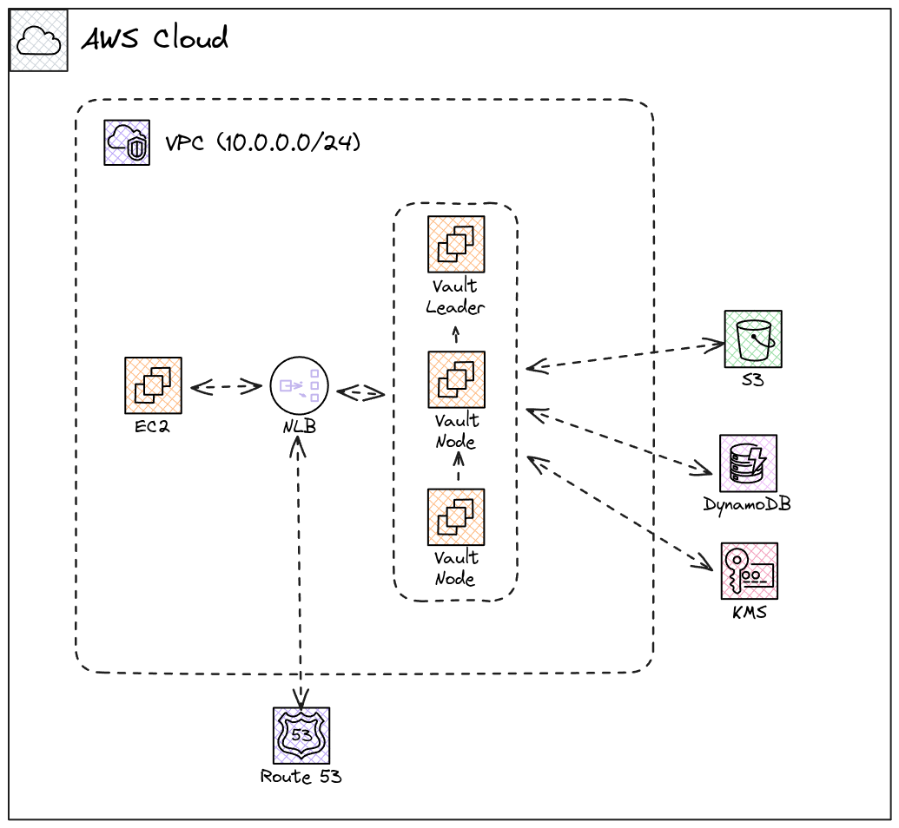
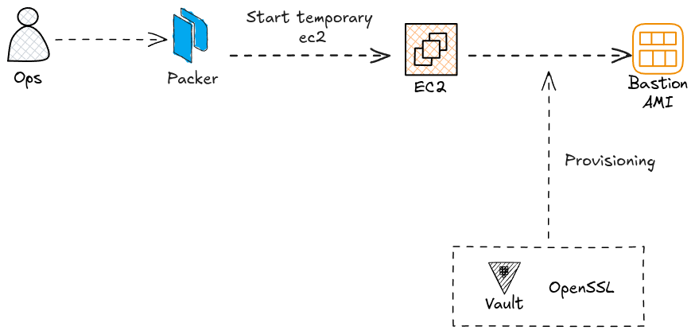

# Vault service
## Architecture overview




# Packer stage

In this stage, i will create Golden AMIs for both Vault and Bastion host. Make sure ``packer`` already installed on your system.

Both ``packer`` file already included ``awscli``, ``vault`` and ``openssl`` for building AMIs.




```bash
cd packer
packer init .
# Build Vault AMI
packer build golden-vault-ami.pkr.hcl

# Build Bastion AMI
packer build golden-standard-ami.pkr.hcl
```

## I will update my blog after Christmas, happy holidays! 